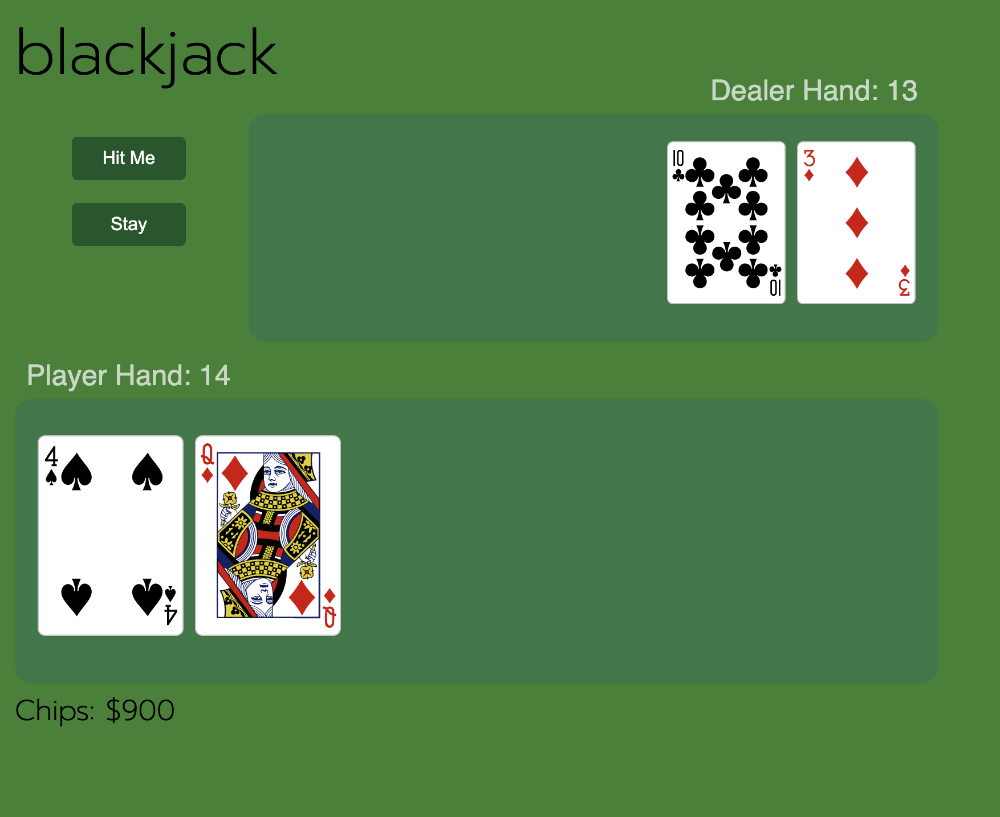
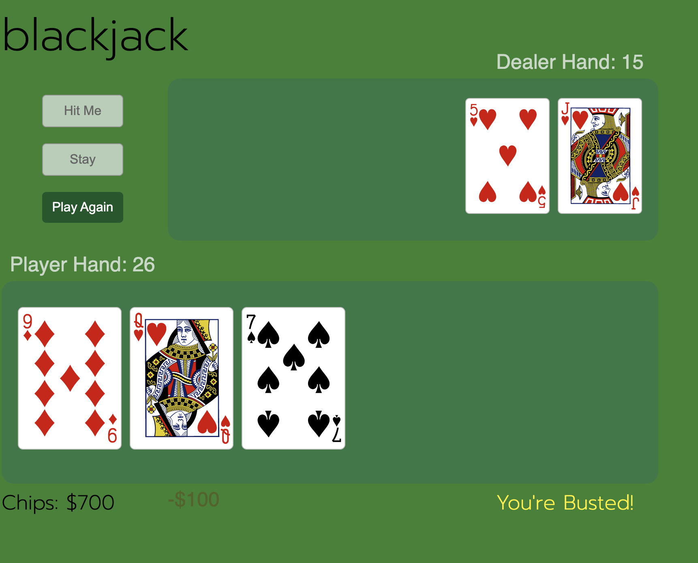

## Blackjack

### Description

This game puts you right in the action at your favorite Blackjack table. You'll start with $1000 in chips, but whether you double these earnings or lose it all will depend on your ability to beat the dealer. Try to get you hand total as close to 21 as possible, but be careful -- if your total exceeds 21, you're busted! Card point totals are as follows:

* 2 - 2 points
* 3 - 3 points
* 4 - 4 points
* 5 - 5 points
* 6 - 6 points
* 7 - 7 points
* 8 - 8 points
* 9 - 9 points
* 10 - 10 points
* J - 10 points
* Q - 10 points
* K - 10 points
* A - 11 points if your hand total is less than 21, otherwise these will count as 1 point so you don't bust

At the start of each hand, both the player and the dealer will receive 2 cards. It's then your choice if you want to hit (add a card to your hand) or stay.

Once you are satisfied with your hand, press the stay button and it will be the dealers turn. The dealer will always stay at 17 or fewer points.

Once the dealer is done with his turn, whoever has the higher amount of points in their hand wins (as long as neither has more than 21). What happens in a tie? You will neither win or lose any money.

Oh almost forgot, after each hand you stand to either gain or lose $100-- so play your cards wisely, and good luck!

### Screenshots 

#### Start of each hand:
Player and dealer are each given two random cards. Two buttons are available: 'Hit Me' and 'Stay'

#### End of each hand:
At the end of each hand, the player sees a message on the lower right of the screen summarizing the outcome. Player will also see a blinking green "+$100" if they win or blinking red "-$100" if they lose. The player's chip total will also update respectively. The 'Hit Me' and 'Stay' buttons become inactive and the 'Play Again' button becomes active. 

### Technologies Used:

JavaScript
HTML
CSS

#### Getting Started

Feelig lucky? There's a seat open for you at the table: 
[Play Now](https://evertm1.github.io/Blackjack)

### Next Steps:

In order to better simulate a real game of of blackjack, my next steps are to display the first card in the dealer's hand face down and hide the dealer hand total until the hand is complete. I'd also like to implement an option for the player to choose their own betting amount prior to the start of each hand.